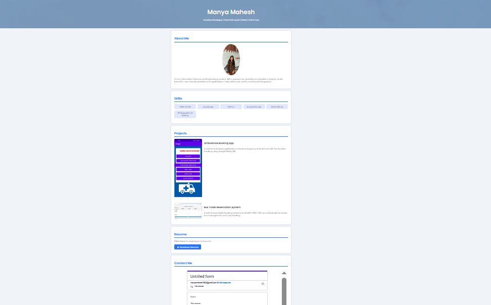
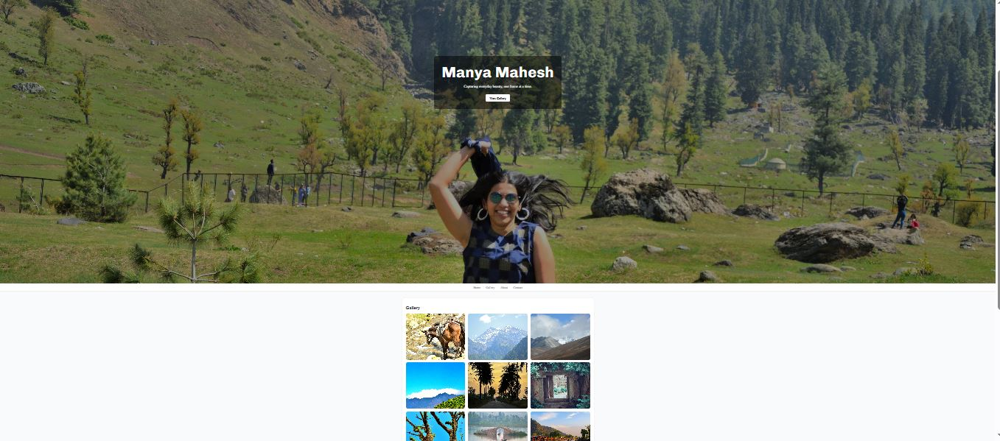
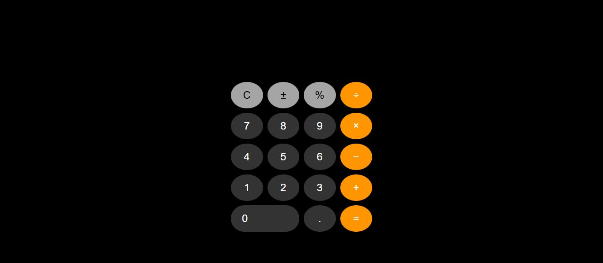

# 🌐 CodSoft Internship – Web Development (July 2025)

Hi! I'm **Manya Mahesh**, and this repository highlights the 3 key projects I completed during **Level 1** of my **CodSoft Web Development Internship**.

---

## ✅ Completed Projects

### 📁 Task 1: Personal Portfolio Website  
📍 [Live Demo](https://manyamahesh.github.io/codesoft-my-portfolio/)  
  
A sleek portfolio built with HTML & CSS showcasing my skills, projects, resume, and contact info.  
🔗 [GitHub Repo → codesoft-my-portfolio](https://github.com/manyamahesh/codesoft-my-portfolio)

---

### 📁 Task 2: Photography Landing Page  
📍 [Live Demo](https://manyamahesh.github.io/codesoft-manya-photography/)  
  
A creative landing site focusing on visuals, implementing a gallery with lightbox and smooth layout.  
🔗 [GitHub Repo → codesoft-manya-photography](https://github.com/manyamahesh/codesoft-manya-photography)

---

### 📁 Task 3: iOS-Style Calculator  
📍 [Live Demo](https://manyamahesh.github.io/codesoft-calculator-task/)  
  
An interactive calculator with responsive layout, iOS-style aesthetic, and full arithmetic functionality.  
🔗 [GitHub Repo → codesoft-calculator-task](https://github.com/manyamahesh/codesoft-calculator-task)

---

## 🎓 Internship Level Completed

- ✅ **Level 1** (All 3 tasks)
- 🗓️ *5 July 2025 – 5 August 2025*
- 🏢 Organization: [CodSoft](https://www.codsoft.in)

---

## 👩‍💻 About Me

I’m currently studying Information Science & Engineering and have a passion for clean design, engaging layouts, and creative coding. I believe in using web tech to tell stories—from hosting events and writing to developing polished websites.

📧 Email: manyamahesh1504@gmail.com  
📸 Instagram: [@shotsbymanyamahesh](https://instagram.com/shotsbymanyamahesh)

---

_Thank you for visiting! Feel free to explore any of the live projects above, and reach out if you’d like to connect._
